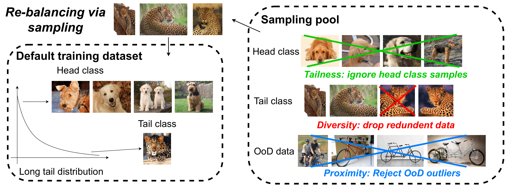

# Improving Contrastive Learning on Imbalanced Data via Open-World Sampling

## Introduction
Contrastive learning approaches have achieved great success in learning visual representations with few labels. 
That implies a tantalizing possibility of scaling them up beyond a curated target benchmark, to incorporating 
more unlabeled images from the internet-scale external sources to enhance its performance. However, in practice, 
with larger amount of unlabeled data, it requires more compute resources for the bigger model size and longer training. 
Moreover, open-world unlabeled data have implicit long-tail distribution of various class attributes, many of which 
are out of distribution and can lead to data imbalancedness issue. This motivates us to seek a principled approach of 
selecting a subset of unlabeled data from an external source that are relevant for learning better and diverse 
representations. In this work, we propose an open-world unlabeled data sampling strategy called 
_Model-Aware K-center_ (**MAK**), which follows three simple principles: (1) _tailness_, which 
encourages sampling of examples from tail classes, by sorting the _empirical contrastive loss expectation_
(**ECLE**) of samples over random data augmentations; (2) _proximity_, which rejects the out-of-distribution 
outliers that might distract training; and (3) _diversity_, which ensures diversity in the set of sampled examples. 
Empirically, using ImageNet-100-LT (without labels) as the target dataset and two ``noisy'' external data sources, 
we demonstrate that MAK can consistently improve both the overall representation quality and class balancedness of 
the learned features, as evaluated via linear classifier evaluation on full-shot and few-shot settings.

## Method


## Environment
Requirements:
```bash
pytorch 1.7.1 
opencv-python
kmeans-pytorch 0.3
scikit-learn
```
Recommend installation cmds (linux)
```bash
conda install pytorch==1.7.1 torchvision==0.8.2 torchaudio==0.7.2 cudatoolkit=10.2 -c pytorch # change cuda version according to hardware
pip install opencv-python
conda install -c conda-forge matplotlib scikit-learn
```

## Sampling
### Prepare
change the access permissions
```bash
chmod +x  cmds/shell_scrips/*
```
Get pre-trained model on LT datasets
```bash
bash ./cmds/shell_scrips/imagenet-100-add-data.sh -g 2 -p 4866 -w 10 --seed 10 --additional_dataset None
```
### Sampling on ImageNet 900
#### Inference 
inference on sampling dataset (no Aug)
```bash
bash ./cmds/shell_scrips/imagenet-100-inference.sh -p 5555 --workers 10 --pretrain_seed 10 \
--epochs 1000 --batch_size 256 --inference_dataset imagenet-900 --inference_dataset_split ImageNet_900_train \
--inference_repeat_time 1 --inference_noAug True
```
inference on sampling dataset (no Aug)
```bash
bash ./cmds/shell_scrips/imagenet-100-inference.sh -p 5555 --workers 10 --pretrain_seed 10 \
--epochs 1000 --batch_size 256 --inference_dataset imagenet-100 --inference_dataset_split imageNet_100_LT_train \
--inference_repeat_time 1 --inference_noAug True
```
inference on sampling dataset (w/ Aug)
```bash
bash ./cmds/shell_scrips/imagenet-100-inference.sh -p 5555 --workers 10 --pretrain_seed 10 \
--epochs 1000 --batch_size 256 --inference_dataset imagenet-900 --inference_dataset_split ImageNet_900_train \
--inference_repeat_time 10
```
sampling 10K at Imagenet900
```bash
bash ./cmds/shell_scrips/sampling.sh --pretrain_seed 10
```


## Citation
```bash
@inproceedings{
jiang2021improving,
title={Improving Contrastive Learning on Imbalanced Data via Open-World Sampling},
author={Jiang, Ziyu and Chen, Tianlong and Chen, Ting and Wang, Zhangyang},
booktitle={Advances in Neural Information Processing Systems 35},
year={2021}
}
```